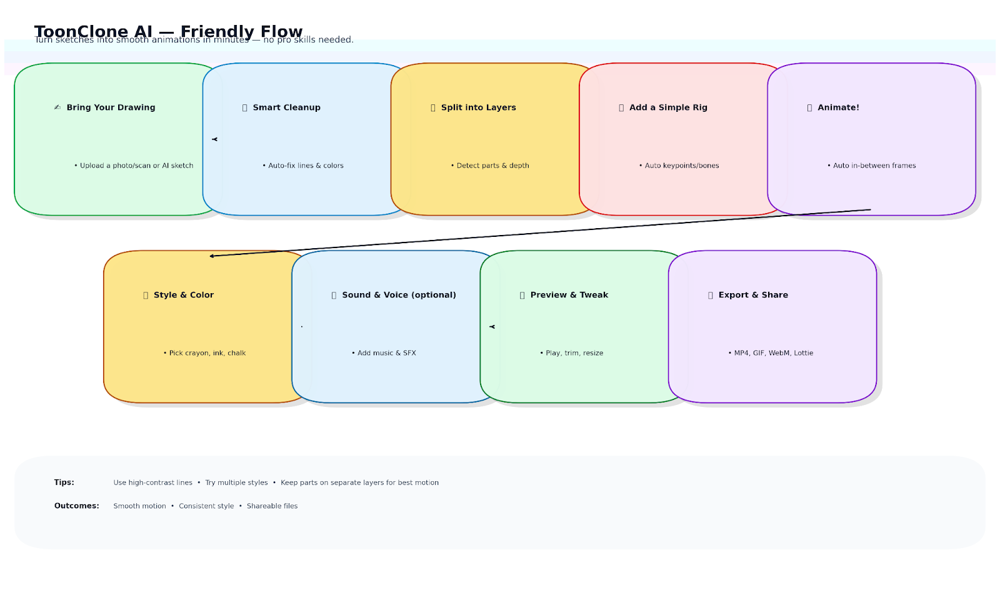
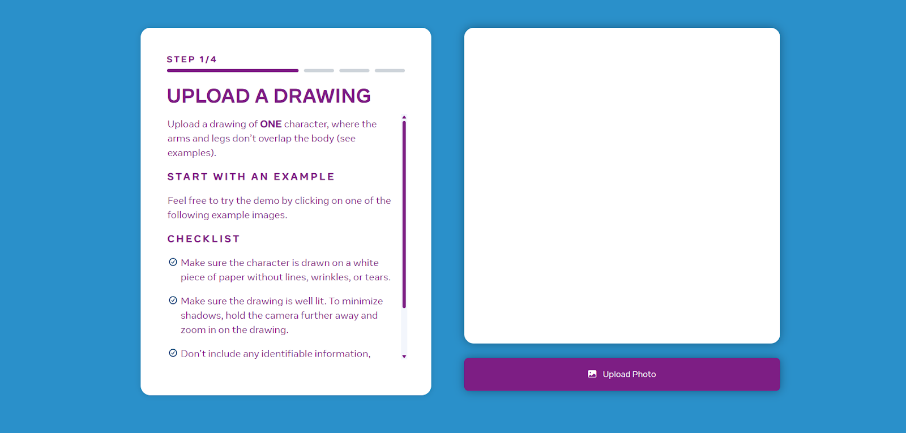
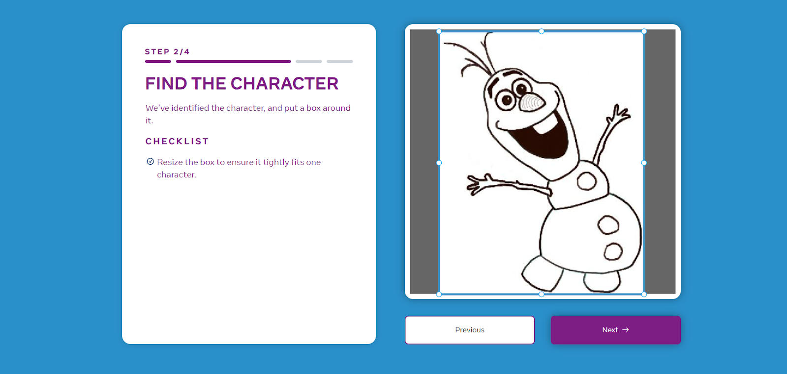
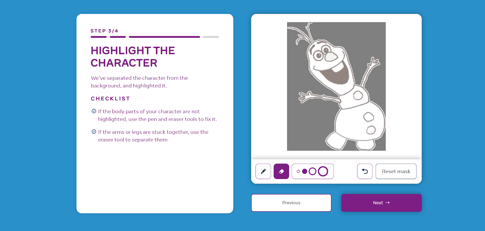
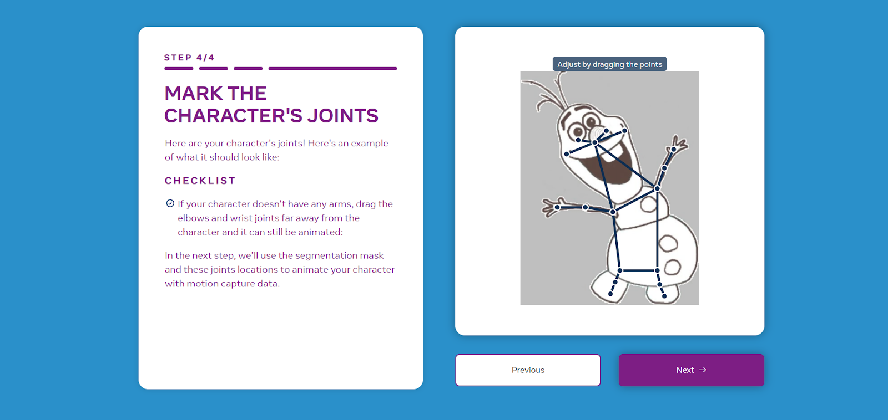
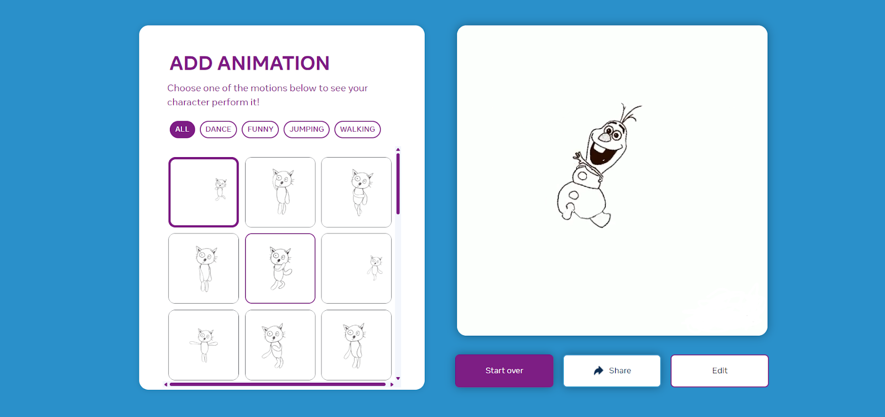
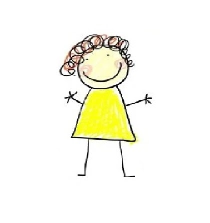
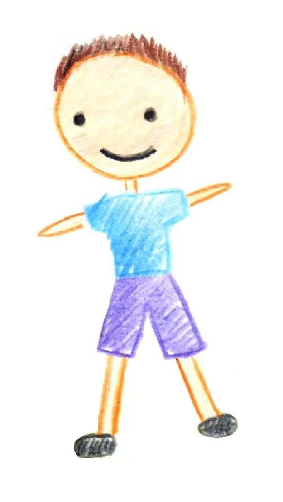

# 🎨 ToonClone AI

**ToonClone AI** is an AI-powered tool that transforms hand-drawn or AI-generated sketches into smooth, engaging animations in just a few simple steps. Designed for users of all skill levels, ToonClone eliminates the need for complex software or animation expertise. With its user-friendly interface and advanced AI, anyone can bring their drawings to life quickly and easily.

---

## 📌 Scheme
- Input: Hand-drawn or AI-generated sketches
- Preprocessing: Cleaning, digitization, resizing, color correction
- AI Processing: CNN-based animation model
- Output: Smooth, stylistically consistent animations

---

## 🖼️ Examples

<table>
    <tbody>
        <tr>
            <td></td>
            <td></td>
        </tr>
        <tr>
            <td></td>
            <td></td>
        </tr>
        <tr>
            <td></td>
            <td></td>
        </tr>
    </tbody>
</table>

---

## 🎥 Animation examples

<table>
    <tbody>
        <tr>
            <td>
                <video src="https://github.com/user-attachments/assets/f6027b57-92e5-43a4-94ab-35f7fa0e23af" controls preload>
                    Your browser does not support the video tag.
                </video>
            </td>
            <td>
                <video src="https://github.com/user-attachments/assets/db329d5d-5f55-47b1-890e-d2f5b4098715" controls preload>
                    Your browser does not support the video tag.
                </video>
            </td>
        </tr>
        <tr>
            <td></td>
            <td></td>
        </tr>
        <tr>
            <td>
                <video src="https://github.com/user-attachments/assets/27e52388-69f9-4b1b-9bfe-f45879066ef0" controls preload>
                    Your browser does not support the video tag.
                </video>
            </td>
            <td>
                <video src="https://github.com/user-attachments/assets/07735e9b-b089-4045-8ecc-237ba943abc5" controls preload>
                    Your browser does not support the video tag.
                </video>
            </td>
        </tr>
        <tr>
            <td>
                <video src="https://github.com/user-attachments/assets/bff2dffb-e6cf-468d-9ba8-065c1e107613" controls preload>
                    Your browser does not support the video tag.
                </video>
            </td>
            <td></td>
        </tr>
    </tbody>
</table>

---

## ⚙️ Technical Description
- **Frameworks**: PyTorch, TensorFlow
- **Languages**: Python
- **Tools & Platforms**: AWS, Microsoft Azure, Google Cloud Platform
- **Model Architecture**: Convolutional Neural Network (CNN) with transfer learning
- **Optimizations**: GPU acceleration, real-time processing (30 fps), style-preserving animation

### Key Metrics
- **Mean Squared Error (MSE):** 0.012
- **Structural Similarity Index (SSI):** 0.92
- **Style Consistency (1-10):** 8.8
- **OOD Detection Accuracy:** 96%
- **Runtime Efficiency:** 30 fps

---

## ✨ Features
- Simple 3-step animation workflow
- Real-time or near real-time rendering
- Style-preserving animations from sketches
- Supports both traditional and AI-generated drawings
- Accessible for beginners, powerful enough for professionals

---

## 🔍 Problem
Traditional animation requires:
- Specialized skills
- Complex and intimidating software
- Time-consuming frame-by-frame editing

---

## 💡 Solution
ToonClone AI simplifies the process:
- Converts sketches into animations in minutes
- No prior animation knowledge required
- AI handles frame interpolation, style preservation, and rendering

---

## 🛠️ Process
1. **Preprocessing**: Clean and prepare input sketches
2. **Model Selection**: CNN-based architecture optimized for image-to-animation tasks
3. **Training & Validation**: Large animation dataset with multiple art styles
4. **Evaluation**: Ensures high fidelity, efficiency, and style retention

---

## 📊 Achievements
- **3,000+ users** within 2 months of launch
- Users across **11+ countries**
- High-quality, stylistically consistent outputs praised by artists
- Applications in **entertainment, marketing, education, storytelling**

---

## 🚀 Future Scope
- Integration of more advanced AI models
- Real-time collaboration for studios & teams
- Mobile accessibility (Android/iOS apps)
- Expanded animation style portfolio
- More export formats & workflow integrations

---

## 📚 References
- *Deep Learning* — Ian Goodfellow, Yoshua Bengio, Aaron Courville
- *Neural Networks and Deep Learning: A Textbook* — Charu C. Aggarwal
- *YOLO: Real-Time Object Detection* — Joseph Redmon, Santosh Divvala
- *ImageNet Classification with Deep Convolutional Neural Networks* — Alex Krizhevsky, Ilya Sutskever, Geoffrey Hinton
- **Deep Learning Specialization** by Andrew Ng (Coursera)

---
